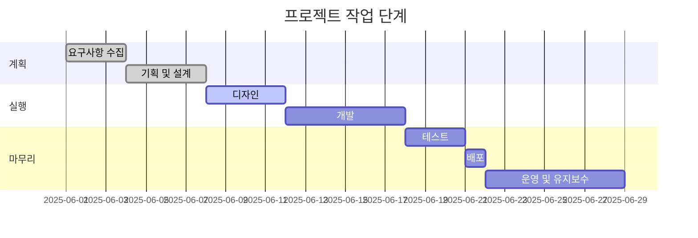

# 철도 작업장 안전관리 웹

## TEST GANTT

```mermaid
gantt
title 프로젝트 작업 단계
dateFormat YYYY-MM-DD
section 계획
요구사항 수집 :done, des1, 2025-06-01, 3d
기획 및 설계 :done, des2, 2025-06-04, 4d
section 실행
디자인 :active, des3, 2025-06-08, 4d
개발 : des4, 2025-06-12, 6d
section 마무리
테스트 : des5, 2025-06-18, 3d
배포 : des6, 2025-06-21, 1d
운영 및 유지보수 : des7, 2025-06-22, 7d
```
