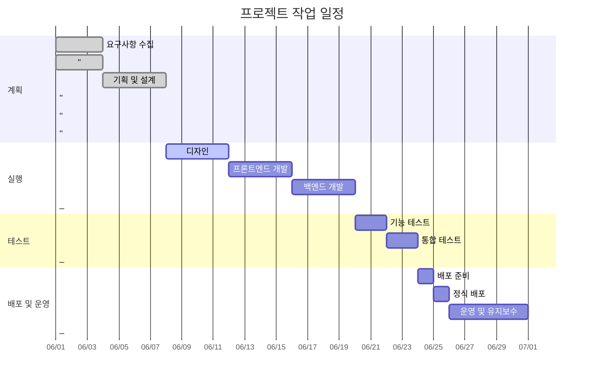

# 철도 작업장 안전관리 웹

```mermaid
gantt
title 프로젝트 작업 일정
dateFormat YYYY-MM-DD
axisFormat %m/%d
%% 화면에 꽉 차 보이도록 섹션을 충분히 배치

section 계획
요구사항 수집       :done,    a1, 2025-06-01, 3d
''            :done,    dummy1, 2025-06-01, 3d
기획 및 설계        :done,    a2, 2025-06-04, 4d
''            :done,    dummy552, 2025-06-01, 0d
''            :done,    dummy12, 2025-06-01, 0d
''            :done,    dummy5555, 2025-06-01, 0d

section 실행
디자인              :active,  a3, 2025-06-08, 4d
프론트엔드 개발       :         a4, 2025-06-12, 4d
백엔드 개발          :         a5, 2025-06-16, 4d
 _           :done,    dummy2, 2025-06-01, 0d

section 테스트
기능 테스트          :         a6, 2025-06-20, 2d
통합 테스트          :         a7, 2025-06-22, 2d
_            :done,    dummy3, 2025-06-01, 0d

section 배포 및 운영
배포 준비            :         a8, 2025-06-24, 1d
정식 배포            :         a9, 2025-06-25, 1d
운영 및 유지보수     :         a10, 2025-06-26, 5d
 _          :done,    dummy4, 2025-06-01, 0d
```

